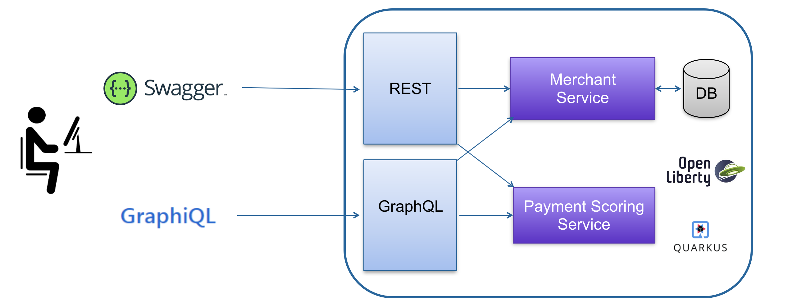

= MicroProfile GraphQL demo for EclipseCon 2020

This a demo to showcase https://github.com/eclipse/microprofile-graphql[MicroProfile GraphQL].

It involves 2 services:

. **Merchant**: provides data and operations on Merchant Acquiring Contracts,
. **Payment Scoring**: provides business metrics about the payment activity of subscribed merchants. 

These services are logically independant, they share nothing except a scoreId to access the metrics for a given merchant.

In reality, they should be provided by downstream services. For the sake of simplicity, in this demo they are implemented and deployed together.

These services are exposed with a REST and a GraphQL APIs.

SwaggerUI and GraphiQL are used to play with these APIs:

== Runtimes

This example is provided with 2 implementations:

* https://quarkus.io/[Red Hat Quarkus]: defined as "Supersonic and Subatomic Java". Quarkus has been designed to run in containers with fast startup time and low memory footprint. It can be run in JVM or native (binary) mode using GraalVM 
* https://openliberty.io/[IBM Open Liberty]: a ligthweight Open framework for buildling fast and efficient cloud-native Java microservices. Open Liberty is a complete implementation of Jakarta EE and MicroProfile with a built-in modular runtime structure (you just run the features you need).

How to run them is described in their respective project README.

Both implementations can be run in parallel since they don't share the ame ports.

== Technical environment

This project has been developed with:

* Maven 3.6.3
* OpenJDK 11.0.7
* Quarkus 1.8.1.Final
* GraalVM 20.2.0
* Open Liberty 20.0.0.10
* Docker Engine 19.03.13

== A few words about the programming model

* The code is based on MicroProfile
* The code structure follows the https://en.wikipedia.org/wiki/Entity-control-boundary[ECB] (Entity Control Boundary) pattern
* The code has been extremely simplified to focus on some basic principles
* Very bad practise: for the sake of simplicity, no tests are provided. Please don't do that in real life!

== Running PostgreSQL

PostgreSQL is used by Merchant service. A script named _postgres.sh_ is provided in the bin directory to start PostgreSQL with Docker.

Don't forget to start it before Quarkus and/or Open Liberty.

== GraphQL examples

These examples can be run with GraphiQL.

=== Demo 1

This example illustrates how to read the needed data and avoid over-fetching:
[source,GraphQL]
----
query demo1 {
  merchant(merchantId: 1) {
    contacts {
      emailAddresses
    }
  }
}
----

=== Demo 2

Same with a list:
[source,GraphQL]
----
query demo2 {
  allMerchants {
    brandName
    activity
    contacts {
      emailAddresses
    }
  }
}
----

=== Demo 3
To get the schema description with Quarkus:
[source]
----
curl http://localhost:8080/graphql/schema.graphql
----
With Open Liberty:
----
curl http://localhost:9080/graphql/schema.graphql
----

Schema introspection:
[source,GraphQL]
----
query demo3 {
  __schema {
    queryType {
      name
      fields {
        name
        description
      }
    }
    mutationType {
      name 
      fields {
        name
        description
      }
    }
  }
}

----

=== Demo 4

Multiple operations:
[source,GraphQL]
----
query demo4 {
  merchant1:merchant(merchantId:1){
    brandName
		businessActivity
    serviceLevel
  }
  merchant2:merchant(merchantId:2){
    cardSchemes
  }
}
----

=== Demo 5

Aggregating services:
[source,GraphQL]
----
query demo5 {
  merchant(merchantId:1) {
    brandName
    scores {
      name
      value
    }
  }
}
----

== Demo 6 

Partial results:
[source,GraphQL]
----
query demo6 {
  merchant(merchantId:1) {
    brandName
    scoreId
    errorOnScores {
      name
      value
    } 
  }
}
----

== Demo 7

Mutation, creating a Merchant:
[source,GraphQL]
----
mutation demo7 {
  createMerchant(merchant :
    {
      brandName: "TexShow"
      activity: ELECTRONIC
      activityLevel: HIGH
      cardSchemes: [AMEX, CB]
    }
  ){
    id
    brandName
    activity
    cardSchemes
  }
}
----

=== Demo 8

Mutation, deleting a Merchant:
[source,GraphQL]
----
mutation demo8 {
  deleteMerchant(merchantId:6)   
}
----

=== Demo 9

Getting specific GraphQL metrics.

With Quarkus:
[source]
----
curl http://localhost:8080/metrics/vendor | grep vendor_mp_graphql
----
With Open Liberty:
[source]
----
curl http://localhost:9080/metrics/vendor | grep vendor_mp_graphql_
----

== Not included in this demo

* Integration with BeanValidation
* Declarative security using @RolesAllowed
* Custom metrics
* Distributed tracing with OpenTracing
* Client-side.

